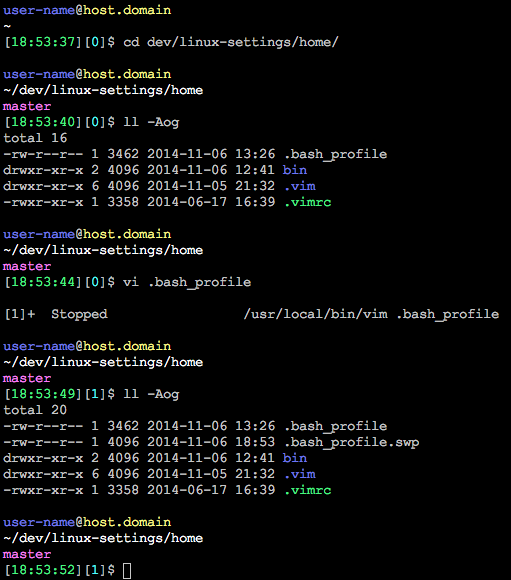
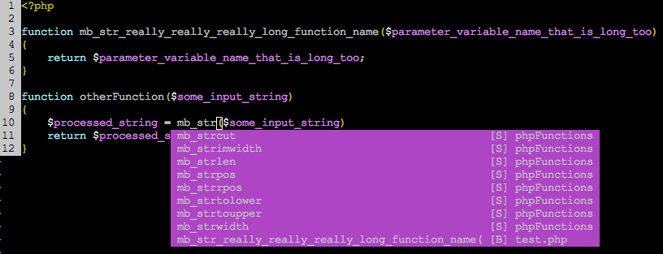

# My Linux Settings
These Linux / Bash / Vim settings and tricks make my life easier when developing

### Multi-line Bash Prompt with Color
The `.bash_profile` in this repository defines the available Bash colors, and then uses them to make a multi-line prompt (`PS1`) with all sorts of information in it.

The look of the prompt I typically use:


**Mine is just an example, please feel free to change this as you like and make your own pretty prompt!**

The above prompt is created using the following code:
(Displayed here in multi-line format for readability, in actual file it is one long line)

```bash
COLOR_PROMPT="
    \n
    $PS_BRIGHT_BLUE\u                   # Username
    $PS_GRAY@
    $PS_BRIGHT_YELLOW\H                 # Hostname
    \n
    $PS_BRIGHT_WHITE\w                  # Current working directory
    $PS_BRIGHT_PURPLE\$(showGitBranch)
    \n
    $PS_GRAY[
    $PS_BRIGHT_GREEN\t                  # Current time (24-hour HH:MM:SS format)
    $PS_GRAY][
    $PS_BRIGHT_CYAN\j                   # Number of current shell jobs running in background
    $PS_GRAY]
    \$                                  # '$' for regular users, '#' for root
"

PS1=$COLOR_PROMPT
export PS1
```

### Auto-complete for Vim ([Neocomplete](https://github.com/Shougo/neocomplete.vim))
PHP Example:

